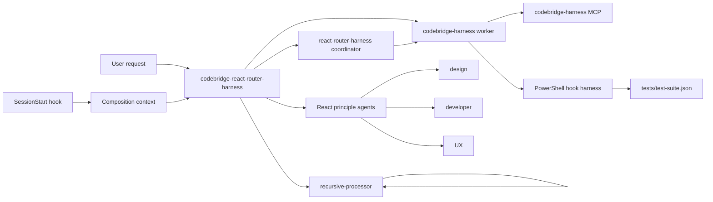

# Codebridge React Router Harness

This workspace validates a VS Code agent-hook composition and exposes it through a local MCP server.

## Harness Architecture



## Composition

`codebridge-react-router-harness` is the entry agent. It can delegate integration work to `react-router-harness`, harness implementation to `codebridge-harness`, and focused analysis to the three principle agents:

- `codebridge-react-design-principle` for design, accessibility, responsiveness, and performance.
- `codebridge-react-developer-principle` for component architecture, composition, specialization, state, and abstractions.
- `codebridge-react-ux-principle` for navigation, feedback, attention, and journeys.

`recursive-processor` splits work only when there are more than four comparable, independent items. Nested subagent invocation is enabled through `.vscode/settings.json`.

The `SessionStart` hook injects this routing orientation into every session. The hook harness verifies that injection together with the pre-tool permission decisions and post-tool error-report context.

## Validation

Run the hook behavior suite:

```powershell
powershell.exe -NoProfile -ExecutionPolicy Bypass -File .\tests\run-harness.ps1
```

Validate the complete customization composition and MCP contract:

```powershell
powershell.exe -NoProfile -ExecutionPolicy Bypass -File .\tests\validate-customizations.ps1
```
