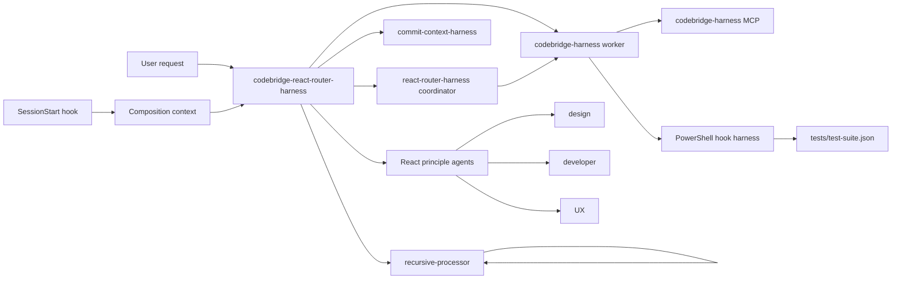

# Codebridge React Router Harness

This workspace validates a VS Code agent-hook composition and exposes it through a local MCP server.

## Harness Architecture



## Composition

`codebridge-react-router-harness` is the entry agent. It can delegate integration work to `react-router-harness`, harness implementation to `codebridge-harness`, and focused analysis to the three principle agents:

- `codebridge-react-design-principle` for design, accessibility, responsiveness, and performance.
- `codebridge-react-developer-principle` for component architecture, composition, specialization, state, and abstractions.
- `codebridge-react-ux-principle` for navigation, feedback, attention, and journeys.
- `commit-context-harness` for drafting commit messages from ContextChanges data without invoking git.

`recursive-processor` splits work only when there are more than four comparable, independent items. Nested subagent invocation is enabled through `.vscode/settings.json`.

The `SessionStart` hook injects this routing orientation into every session. The hook harness verifies that injection together with the pre-tool permission decisions and post-tool error-report context.

## Generic Plugin Import

The repository is now shaped around a single canonical Agent Plugins 1.0 package:

- `plugin.json` is the portable root manifest for clients that support Agent Plugins 1.0.
- `mcp.json` is the portable MCP server definition for the shared `codebridge-harness` server.
- `skills/` contains portable skill packages discovered by compatible clients.
- `com.github.copilot/` contains VS Code and Copilot-specific agents, hooks, and rules.
- `.claude-plugin/plugin.json`, `.mcp.json`, and `hooks/hooks.json` provide Claude and legacy compatibility adapters that point back to the same scripts and MCP server.
- `.plugin/plugin.json` is retained as a legacy OpenPlugin-style adapter.

The package should be imported from the repository root. Workspace-only files such as `.vscode/mcp.json`, `.claude/settings.json`, `rules/`, `agents/`, and `.hooks/` remain useful while developing this repo locally, but the root plugin files are the import surface.

## Validation

Run the hook behavior suite:

```powershell
powershell.exe -NoProfile -ExecutionPolicy Bypass -File .\tests\run-harness.ps1
```

Validate the complete customization composition and MCP contract:

```powershell
powershell.exe -NoProfile -ExecutionPolicy Bypass -File .\tests\validate-customizations.ps1
```
