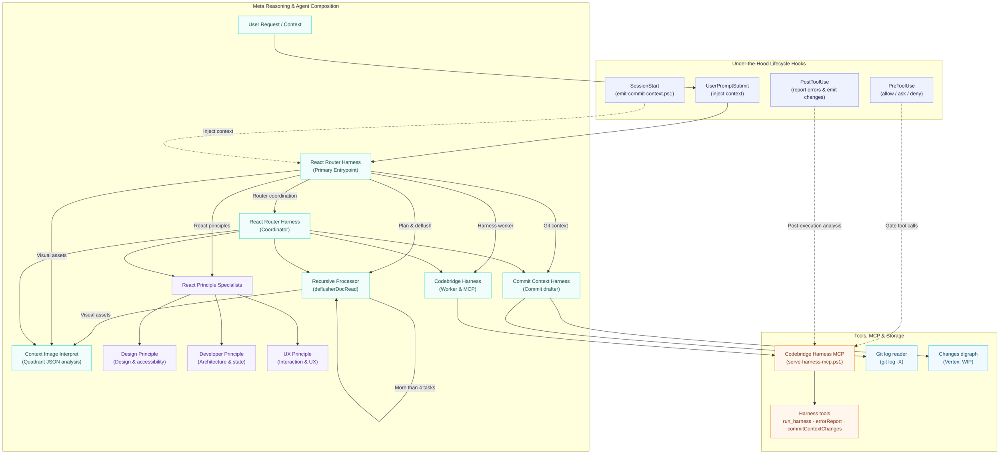
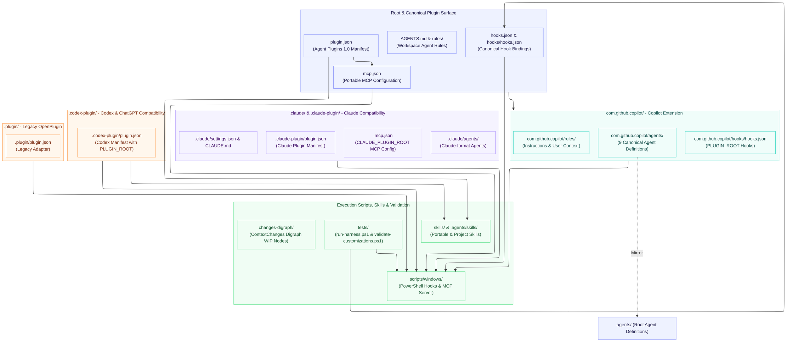

# Codebridge React Router Harness

This workspace validates a VS Code agent-hook composition and exposes it through a local MCP server.

## Harness Architecture

### Meta Reasoning Trajectory

Theoretical under-the-hood reasoning flow, agent delegation hierarchy, and hook execution lifecycle:



### File System Trajectory

Physical repository layout, plugin manifests, extension namespaces, and multi-ecosystem import surfaces:




## Composition

`codebridge-react-router-harness` is the entry agent. It can delegate integration work to `react-router-harness`, harness implementation to `codebridge-harness`, and focused analysis to the three principle agents:

- `codebridge-react-design-principle` for design, accessibility, responsiveness, and performance.
- `codebridge-react-developer-principle` for component architecture, composition, specialization, state, and abstractions.
- `codebridge-react-ux-principle` for navigation, feedback, attention, and journeys.
- `commit-context-harness` for drafting commit messages from ContextChanges data without invoking git.
- `contextImageInterpret` for structured visual analysis (quadrants, object inventory, color temperature, 4-line description) whenever pictures or diagrams are provided.

`recursive-processor` acts as the `deflusherDocRead` pre-processor: before broad source reads, repository scans, or web searches, it converts the user message into taskList, intention, contextualDescription, and a minimal docReadPlan. It still splits work recursively when there are more than four comparable, independent items. Nested subagent invocation is enabled through `.vscode/settings.json`.

The `SessionStart` hook injects this routing orientation into every session. The hook harness verifies that injection together with the pre-tool permission decisions and post-tool error-report context.

## Generic Plugin Import

The repository is now shaped around a single canonical Agent Plugins 1.0 package:

- `.codex-plugin/plugin.json` is the Codex and ChatGPT plugin manifest.
- `plugin.json` is the portable root manifest for clients that support Agent Plugins 1.0.
- `mcp.json` is the portable MCP server definition for the shared `codebridge-harness` server.
- `skills/` contains portable skill packages discovered by compatible clients.
- `com.github.copilot/` contains VS Code and Copilot-specific agents, hooks, and rules.
- `.claude-plugin/plugin.json`, `.mcp.json`, and `hooks/hooks.json` provide Claude and legacy compatibility adapters that point back to the same scripts and MCP server.
- `.plugin/plugin.json` is retained as a legacy OpenPlugin-style adapter.

The package should be imported from the repository root. Workspace-only files such as `.vscode/mcp.json`, `.claude/settings.json`, `rules/`, `agents/`, and `.hooks/` remain useful while developing this repo locally, but the root plugin files are the import surface.

For Codex, the required entrypoint is `.codex-plugin/plugin.json`. The manifest points to the shared `skills/` folder and declares the `codebridge-harness` MCP server with `PLUGIN_ROOT`, so the installed plugin can start the same PowerShell server from its cache path. The default Codex hook path is `hooks/hooks.json`, which remains present at the plugin root.

A Git-backed marketplace entry can point directly at this repository root:

```json
{
  "name": "codebridge-react-router-harness",
  "source": {
    "source": "url",
    "url": "https://github.com/muraraallan/codebdrige-react-router-harness.git",
    "ref": "main"
  },
  "policy": {
    "installation": "AVAILABLE",
    "authentication": "ON_INSTALL"
  },
  "category": "Productivity"
}
```

## Validation

Run the hook behavior suite:

```powershell
powershell.exe -NoProfile -ExecutionPolicy Bypass -File .\tests\run-harness.ps1
```

Validate the complete customization composition and MCP contract:

```powershell
powershell.exe -NoProfile -ExecutionPolicy Bypass -File .\tests\validate-customizations.ps1
```

## Recent Changes

1. **Synchronized agent composition parity & dual trajectory diagrams**
   - **L1**: Updated [README.md](README.md) with two comprehensive diagrams: `Meta Reasoning Trajectory` (theoretical/hook lifecycle & metaOrchestrator FeedForward) and `File System Trajectory` (physical repository layout across Copilot, Claude, Codex, and legacy namespaces).
   - **L2**: Aligned [com.github.copilot/agents/codebridge-react-router-harness.agent.md](com.github.copilot/agents/codebridge-react-router-harness.agent.md) with [agents/codebridge-react-router-harness.agent.md](agents/codebridge-react-router-harness.agent.md) and aligned [hooks.json](hooks.json) / [com.github.copilot/hooks/hooks.json](com.github.copilot/hooks/hooks.json) to use `PLUGIN_ROOT`.
   - **L3**: Validated test harness and customization tests with 100% pass rate.

2. **extend codex plugin** (`3677cb57`)
   - Extended Codex plugin manifest and setup integration.

2. **Extended recursive agent into deflusherDocRead pre-processor** (`bb0f68db`)
   - **L1**: Updated [agents/recursive-processor.agent.md](agents/recursive-processor.agent.md) and [com.github.copilot/agents/recursive-processor.agent.md](com.github.copilot/agents/recursive-processor.agent.md) to produce a FeedForward packet: `taskList`, `intention`, `contextualDescription`, `docReadPlan`, and `processingMode`.
   - **L2**: Updated [tests/validate-customizations.ps1](tests/validate-customizations.ps1) so validation requires the `deflusherDocRead` contract.
   - **L3**: Documented pre-processor behavior.

3. **Implemented first pass toward generic plugin import** (`1a699dad`)
   - **L1**: Added canonical Agent Plugins files: [plugin.json](plugin.json) and [mcp.json](mcp.json). Added Claude/legacy adapters in [.claude-plugin/plugin.json](.claude-plugin/plugin.json), [.mcp.json](.mcp.json), [hooks/hooks.json](hooks/hooks.json), and [.plugin/plugin.json](.plugin/plugin.json).
   - **L2**: Added VS Code/Copilot namespace files under [com.github.copilot](com.github.copilot), updated [.vscode/settings.json](.vscode/settings.json) for moved `.hooks/`, and updated [tests/validate-customizations.ps1](tests/validate-customizations.ps1).
   - **L3**: Maintained repo-root canonical surface with multi-ecosystem compatibility.

4. **try to organize** (`3fcb8f1d`)
   - Initial organization pass for workspace scripts and repository layout.
